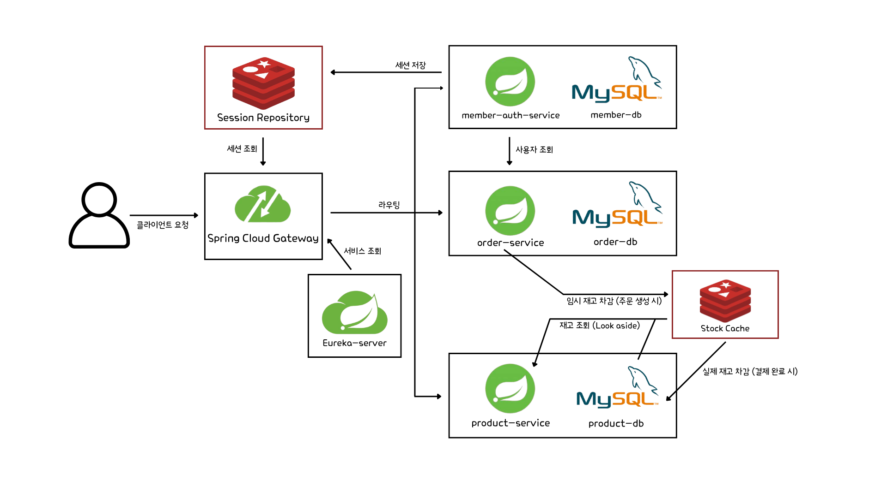

# 선착순 구매 시스템

## Overview
- 선착순 구매를 구현하는 MSA 기반의 쇼핑몰 시스템입니다.
- 서비스 간 통신에는 `Spring Cloud OpenFeign`을 사용하고, 서비스 디스커버리를 위해 `Netflix Eureka`를 도입했습니다.
- 동시성 제어가 필요한 재고 관리는 `Redis`를 활용하여 처리하며, 세션 관리도 `Redis`를 통해 중앙화했습니다.

## Architecture

## Service Description

### Gateway Service
- Spring Cloud Gateway 기반 API 게이트웨이
- 기능
- 라우팅
- 인증/인가 필터
- 요청/응답 로깅 필터

### Discovery Service
- Netflix Eureka 기반 서비스 디스커버리
- 기능
- 서비스 등록 및 탐색

### Member Auth Service
- 회원 및 인증 관리 서비스
- 기능
- 회원 관리
- 세션 기반 인증
- 이메일 인증

### Product Service
- 상품 및 재고 관리 서비스
- 기능
- 상품 정보 관리
- 재고 관리

### Order Service
- 주문 및 장바구니 관리 서비스
- 기능
- 주문 프로세스
- 장바구니 관리
- 재고 연동

## Tech Stack

### Language & Framework
- Java 21
- Spring Boot 3.x
- Spring Cloud

### Database & Cache
- MySQL (데이터 저장)
- Redis (세션/캐시)

### MSA Components
- Netflix Eureka (서비스 디스커버리)
- Spring Cloud Gateway
- Spring Cloud OpenFeign (서비스 간 통신)